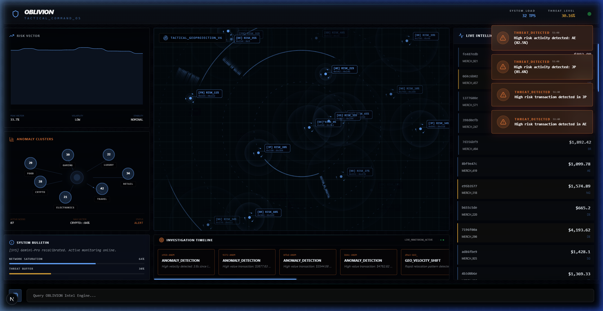

# OBLIVION — FINANCIAL INTELLIGENCE OS

A production-grade, holographic financial monitoring platform built with Next.js 16, Tailwind CSS 4, and Gemini AI. Experience the next generation of tactical command.



## 🚀 Features

- **Holographic Tactical Map**: Real-time geolocation of global financial transactions with nested orbital tracking and signal pings.
- **Anomaly Clusters**: AI-driven sector visualization using staggered radial layouts for zero-overlap clarity and tactical precision.
- **Live Intelligence Pulse**: High-frequency data stream monitor with real-time risk scoring, stability analysis, and volatility tracking.
- **AI Intel Engine**: Integrated Gemini-powered reasoning engine for automated tactical summaries and system-wide directives.
- **Tactical Alert System**: Instant threat detection with high-visibility holographic overlays and smooth, top-down animation flow.
- **Full Mobile Responsiveness**: Seamless operation across desktop workstations and mobile tactical units with floating command modules.

## 🛠️ Tech Stack

- **Next.js 16**: Modern React framework for high-performance, server-safe dashboard architecture.
- **Tailwind CSS 4**: Next-gen utility styling engine for rapid, cinematic UI development and tactical aesthetics.
- **Framer Motion**: High-performance animation engine for fluid transitions and holographic glitch effects.
- **Socket.io**: Real-time bidirectional communication for instant data synchronization across all units.
- **Google Gemini API**: Advanced generative AI for automated threat analysis and strategic intelligence.

## 📦 Installation

1. Clone the repository:
   ```bash
   git clone https://github.com/Aesannn/oblivion.git
   ```

2. Install dependencies:
   ```bash
   # Install for both client and server
   cd client && npm install
   cd ../server && npm install
   ```

3. Run the development server:
   ```bash
   # From the root directory
   npm run dev
   ```

## 🌐 Deployment

Hosted on **Vercel**. Connect your GitHub repository for automatic deployments.

---

# Created by [Aesannn](https://github.com/Aesannn)

# oblivion

Immersive. Tactical. Premium. A next-gen financial intelligence OS experience.
